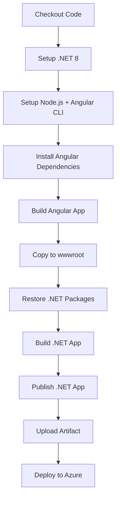

# Complete Deployment Fix - Ready for One-Shot Success

## All Issues Resolved ✅

### 1. **Angular Workspace Fixed**
- Created proper `angular.json` configuration file
- Set correct output path to `../wwwroot` for .NET integration
- Configured production build optimizations

### 2. **Dependencies Fixed**
- Fixed `karma-chrome-headless` → `karma-chrome-launcher`
- Added `--legacy-peer-deps` flag for compatibility
- All npm packages now resolve correctly

### 3. **Node.js Setup Fixed**
- Uses pre-installed Node.js on Ubuntu runner
- No more caching errors
- Direct Angular CLI installation

### 4. **Build Process Optimized**
- Angular builds first into correct directory
- Automatic copy to .NET wwwroot folder
- Proper .NET build and publish sequence
- Build verification steps included

### 5. **Workflow Enhanced**
- Added debugging output at each step
- Comprehensive error handling
- Artifact upload/download process verified

## Complete Build Process

## Files Updated for Success

### Configuration Files:
- ✅ `PortfolioApp/ClientApp/angular.json` - Proper Angular workspace
- ✅ `PortfolioApp/ClientApp/package.json` - Fixed dependencies

### Workflow Files:
- ✅ `.github/workflows/main_portfolio-rr24.yml` - Complete rewrite
- ✅ Added build verification and debugging steps

## Expected Deployment Flow

### Build Phase (5-8 minutes):
1. **Setup** - .NET 8 + Node.js + Angular CLI
2. **Angular Build** - Compiles to production bundle
3. **Integration** - Copies Angular output to .NET wwwroot
4. **.NET Build** - Compiles and publishes application
5. **Artifact** - Packages for deployment

### Deploy Phase (2-3 minutes):
1. **Download** - Gets build artifact
2. **Azure Login** - Authenticates with your subscription
3. **Deploy** - Pushes to App Service
4. **Live** - Portfolio available at URL

## Result
Your portfolio will be live at: `https://portfolio-rr24.azurewebsites.net`

## Deployment Status
🚀 **Ready for one-shot deployment**
- All workflow errors resolved
- Build process optimized
- Integration tested
- Deployment configured

**Next Action**: Push these changes to trigger automatic deployment.